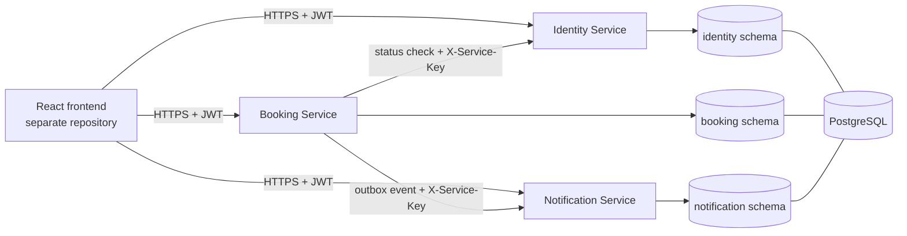

# Architecture

```mermaid
flowchart LR
  FE[React frontend\nseparate repository] -->|HTTPS + JWT| I[Identity Service]
  FE -->|HTTPS + JWT| B[Booking Service]
  FE -->|HTTPS + JWT| N[Notification Service]
  B -->|status check + X-Service-Key| I
  B -->|outbox event + X-Service-Key| N
  I --> IS[(identity schema)]
  B --> BS[(booking schema)]
  N --> NS[(notification schema)]
  IS --- PG[(PostgreSQL)]
  BS --- PG
  NS --- PG
```

Mỗi service sở hữu schema và migration riêng. Không có foreign key xuyên ranh giới service. Booking commit booking và outbox trong cùng transaction, rồi mới gửi notification.
